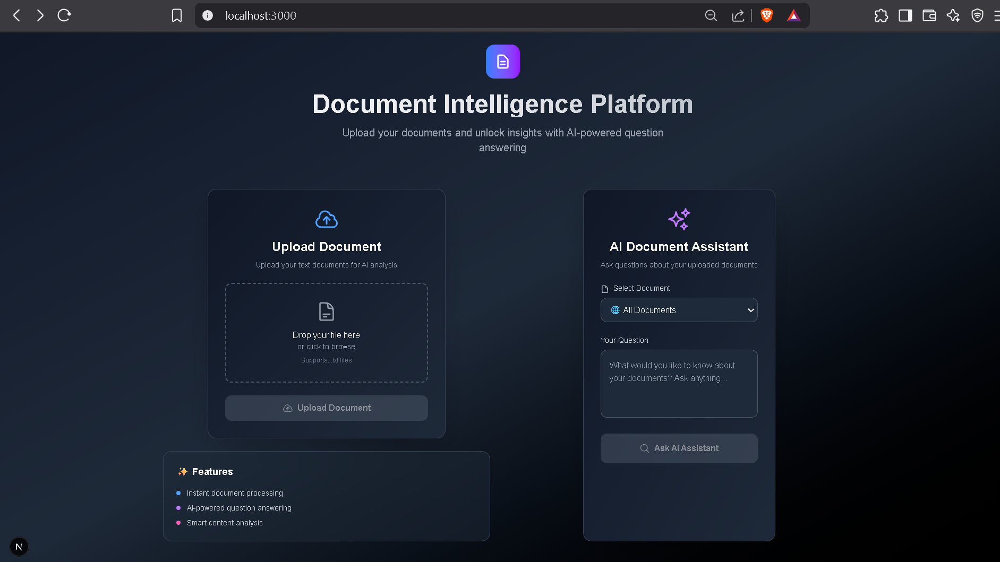
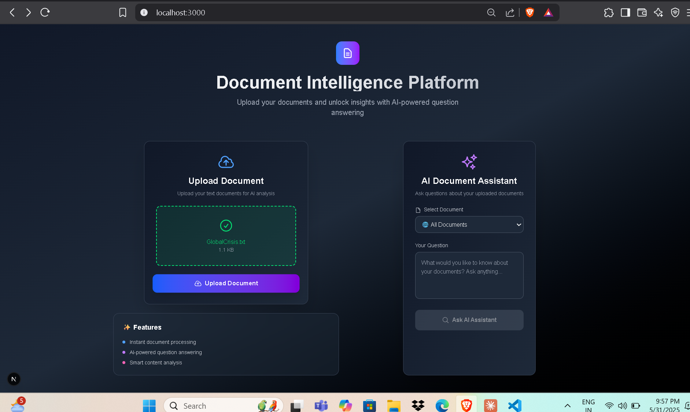
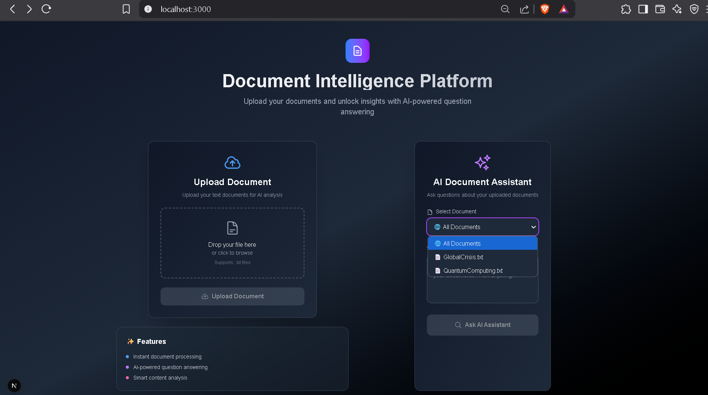
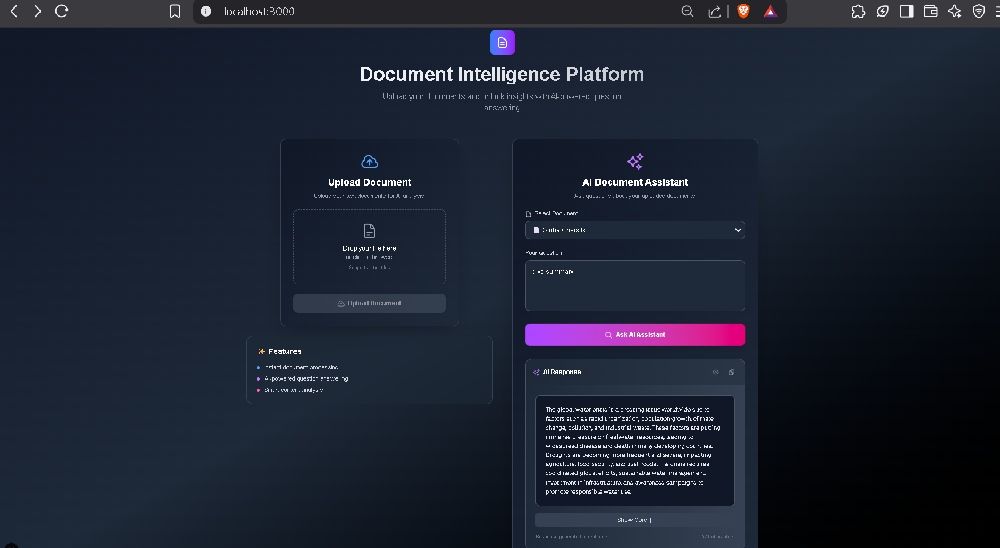

# Document Intelligence Platform

A full-stack web application that enables users to upload documents and ask natural language questions about their content using AI-powered Retrieval Augmented Generation (RAG).

## 🚀 Features

- **Document Upload**: Support for TXT, PDF, DOCX files with drag-and-drop interface
- **AI-Powered Q&A**: Ask natural language questions about uploaded documents
- **Smart Document Processing**: Automatic text chunking and vector embedding generation
- **Responsive UI**: Modern dark-themed interface built with React and Tailwind CSS
- **Real-time Processing**: Instant document processing and query responses
- **Vector Search**: Semantic similarity search using ChromaDB
- **Local AI Support**: Works with Ollama for privacy-focused local AI processing

## 📸 UI Screenshots

### Main Dashboard

*Clean, modern interface with upload and query sections side by side*

### Document Upload Interface

*Drag-and-drop file upload with visual feedback and file type validation*

### Document Selection & Query Interface

*Document selection dropdown and AI assistant interface with expandable responses*

### AI Response Display

*Comprehensive AI responses with copy functionality and source citations*

## 🛠️ Tech Stack

### Backend
- **Framework**: Django REST Framework
- **Database**: SQLite (development) / PostgreSQL (production)
- **Vector Database**: ChromaDB for embeddings storage
- **AI/ML**: Sentence Transformers for embeddings, Ollama for text generation
- **File Processing**: PyPDF2, python-docx for document parsing
- **API**: RESTful APIs with comprehensive error handling

### Frontend
- **Framework**: Next.js 14 with TypeScript
- **Styling**: Tailwind CSS with custom dark theme
- **Icons**: Heroicons for consistent iconography
- **HTTP Client**: Axios for API communication
- **UI Components**: Custom responsive components

### AI & ML
- **Embeddings**: Sentence Transformers (all-MiniLM-L6-v2)
- **Vector Storage**: ChromaDB with persistent storage
- **Text Generation**: Ollama (local) 
- **Document Processing**: Smart chunking with context preservation

## 📋 Prerequisites

- Python 3.8+
- Node.js 16+
- Ollama (for local LLM)
- Git for version control

## 🚀 Setup Instructions

### Backend Setup

1. **Clone the repository**
git clone <your-repo-url>
cd document-intelligence-platform

text

2. **Create and activate virtual environment**
python -m venv venv

On Windows
venv\Scripts\activate

On macOS/Linux
source venv/bin/activate

text

3. **Install backend dependencies**
cd backend
pip install -r requirements.txt

text

4. **Configure environment variables**
Create .env file in backend directory
touch .env

Add the following to .env file:
DJANGO_SECRET_KEY=your_secret_key_here
DEBUG=True

text

5. **Run database migrations**
python manage.py makemigrations
python manage.py migrate

text

6. **Create superuser (optional)**
python manage.py createsuperuser

text

7. **Start Django development server**
python manage.py runserver

text
Backend will be available at `http://localhost:8000`

### Frontend Setup

1. **Navigate to frontend directory**
cd ../frontend

text

2. **Install frontend dependencies**
npm install

text

3. **Configure environment variables**
Create .env.local file
touch .env.local

Add the following:
NEXT_PUBLIC_API_URL=http://localhost:8000/api

text

4. **Start development server**
npm run dev

text
Frontend will be available at `http://localhost:3000`

### Ollama Setup (Recommended for Local AI)

1. **Install Ollama**
On macOS
brew install ollama

On Linux
curl -fsSL https://ollama.ai/install.sh | sh

On Windows
Download from https://ollama.ai/download
text

2. **Pull a language model**
ollama pull llama2

or
ollama pull mistral

text

3. **Start Ollama service**
ollama serve

text
Ollama will be available at `http://localhost:11434`

## 📚 API Documentation

### Base URL
http://localhost:8000/api/

text

### Authentication
Currently, no authentication is required for development.

### Endpoints

#### 1. Get All Documents
GET /documents/

text

**Response:**
[
{
"id": 1,
"title": "document.txt",
"file_type": "txt",
"file_size": 1024,
"processing_status": "completed",
"created_at": "2025-05-31T10:30:00Z"
}
]

text

#### 2. Upload Document
POST /documents/upload/
Content-Type: multipart/form-data

text

**Request:**
file: <file_object>

text

**Response:**
{
"id": 1,
"status": "uploaded",
"message": "Successfully processed 5 chunks",
"chromadb_count": 15
}

text

#### 3. Query Documents
POST /documents/query/
Content-Type: application/json

text

**Request:**
{
"document_id": 1,
"question": "What is the main topic of this document?"
}

text

**Response:**
{
"answer": "The main topic of this document is artificial intelligence and its applications in modern technology...",
"document_id": 1,
"question": "What is the main topic of this document?"
}

text

#### 4. Debug System Status
GET /debug/

text

**Response:**
{
"database_documents": 3,
"chromadb_items": 15,
"documents": [...]
}

text

### Error Responses

All endpoints return errors in the following format:
{
"error": "Detailed error message description"
}

text

Common HTTP status codes:
- `400` - Bad Request (missing parameters)
- `404` - Not Found (document doesn't exist)
- `500` - Internal Server Error

## 💬 Sample Q&A Examples

### Example 1: Document Summary
**Document**: `GlobalCrisis.txt`
**Question**: "Can you provide a summary of this document?"
**Answer**: "This document discusses the current global crisis, highlighting key factors such as economic instability, climate change impacts, and geopolitical tensions. It emphasizes the interconnected nature of these challenges and proposes collaborative solutions for addressing them effectively."

### Example 2: Specific Information Extraction
**Document**: `QuantumComputing.txt`
**Question**: "What are the main advantages of quantum computing mentioned?"
**Answer**: "The document outlines several key advantages of quantum computing: 1) Exponential speedup for certain computational problems, 2) Ability to solve complex optimization problems, 3) Enhanced cryptographic capabilities, and 4) Potential breakthroughs in drug discovery and materials science."

### Example 3: Multi-Document Query
**Question**: "What common themes appear across all uploaded documents?"
**Answer**: "Analyzing all uploaded documents, common themes include technological innovation, global challenges requiring collaborative solutions, and the importance of sustainable development practices in addressing future uncertainties."

### Example 4: Technical Details
**Document**: `TechnicalManual.pdf`
**Question**: "What are the installation requirements mentioned in the manual?"
**Answer**: "The installation requirements include: Python 3.8+, minimum 8GB RAM, 50GB available disk space, and a stable internet connection for initial setup and model downloads."

## 🔧 Configuration

### Django Settings (settings.py)
CORS Configuration
CORS_ALLOWED_ORIGINS = [
"http://localhost:3000",
"http://127.0.0.1:3000",
]

Media Files
MEDIA_URL = '/media/'
MEDIA_ROOT = os.path.join(BASE_DIR, 'media')

File Upload Limits
FILE_UPLOAD_MAX_MEMORY_SIZE = 10 * 1024 * 1024 # 10MB
DATA_UPLOAD_MAX_MEMORY_SIZE = 10 * 1024 * 1024 # 10MB

ChromaDB Configuration
CHROMADB_PATH = os.path.join(BASE_DIR, 'chromadb_data')

text

### Environment Variables

#### Backend (.env)
DJANGO_SECRET_KEY=your_secret_key
DEBUG=True
ALLOWED_HOSTS=localhost,127.0.0.1

text

#### Frontend (.env.local)
NEXT_PUBLIC_API_URL=http://localhost:8000/api
NEXT_PUBLIC_APP_NAME=Document Intelligence Platform

text

## 🧪 Testing

### Backend Tests
cd backend
python manage.py test

text

### Frontend Tests
cd frontend
npm test

text

### Manual Testing
1. Upload a sample document
2. Ask various questions about the content
3. Test with different file formats
4. Verify error handling with invalid inputs

## 📁 Project Structure

document-intelligence-platform/
├── README.md
├── screenshots/
│ ├── dashboard.png
│ ├── upload.png
│ ├── query.png
│ ├── response.png
│ └── library.png
├── backend/
│ ├── requirements.txt
│ ├── manage.py
│ ├── backend/
│ │ ├── init.py
│ │ ├── settings.py
│ │ ├── urls.py
│ │ └── wsgi.py
│ ├── documents/
│ │ ├── init.py
│ │ ├── models.py
│ │ ├── views.py
│ │ ├── urls.py
│ │ ├── rag_engine.py
│ │ └── migrations/
│ ├── media/
│ └── chromadb_data/
├── frontend/
│ ├── package.json
│ ├── next.config.js
│ ├── tailwind.config.js
│ ├── components/
│ │ ├── DocumentUpload.tsx
│ │ ├── QueryInterface.tsx
│ │ └── DocumentManager.tsx
│ ├── pages/
│ │ ├── index.tsx
│ │ └── _app.tsx
│ ├── styles/
│ │ └── globals.css
│ └── utils/
│ └── api.ts
└── .gitignore

text

### Frontend Deployment (Vercel/Netlify)

1. **Build the project**
npm run build

text

2. **Deploy to platform**
- Connect GitHub repository
- Configure build settings
- Set environment variables

## 🔒 Security Considerations

- **File Upload Validation**: Only allow specific file types
- **File Size Limits**: Prevent large file uploads
- **Input Sanitization**: Clean user inputs before processing
- **API Rate Limiting**: Implement rate limiting for production
- **Environment Variables**: Never commit sensitive data to version control

## 🤝 Contributing

1. Fork the repository
2. Create a feature branch (`git checkout -b feature/amazing-feature`)
3. Commit your changes (`git commit -m 'Add amazing feature'`)
4. Push to the branch (`git push origin feature/amazing-feature`)
5. Open a Pull Request

### Development Guidelines

- Follow PEP 8 for Python code
- Use TypeScript for frontend development
- Write descriptive commit messages
- Add tests for new features
- Update documentation for API changes

## 🆘 Troubleshooting

### Common Issues

#### 1. CORS Errors
**Problem**: Frontend cannot connect to backend
**Solution**: 
- Ensure `django-cors-headers` is installed
- Add frontend URL to `CORS_ALLOWED_ORIGINS`
- Restart Django server

#### 2. File Upload Issues
**Problem**: Files not uploading or processing
**Solution**:
- Check `MEDIA_ROOT` permissions
- Verify file size limits
- Check Django logs for errors

#### 3. ChromaDB Connection Issues
**Problem**: Documents not being stored in vector database
**Solution**:
- Ensure ChromaDB directory exists and is writable
- Check for initialization errors in logs
- Restart the application

#### 4. Ollama Connection Errors
**Problem**: AI responses not generating
**Solution**:
- Verify Ollama is running: `ollama serve`
- Check if model is downloaded: `ollama list`
- Test connection: `curl http://localhost:11434/api/tags`

#### 5. Frontend Build Issues
**Problem**: Next.js build failures
**Solution**:
- Clear node_modules: `rm -rf node_modules && npm install`
- Check for TypeScript errors
- Verify environment variables

### Debug Mode

Enable debug mode for detailed error information:

Backend
export DEBUG=True

Frontend
export NODE_ENV=development

text

### Logs Location

- **Django logs**: Console output when running `python manage.py runserver`
- **Next.js logs**: Console output when running `npm run dev`
- **Ollama logs**: Check Ollama service logs

## 📞 Support

For issues, questions, or contributions:

- **Email**: [dhruvgaur1123@gmail.com]
- **GitHub Issues**: [Repository Issues Page]

**Built with ❤️ for the Document Intelligence Platform Assignment**

*Last updated: May 31, 2025*
